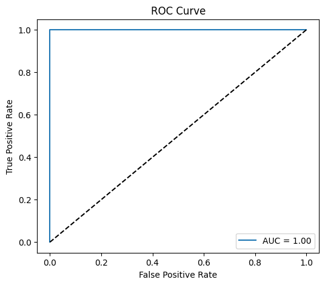
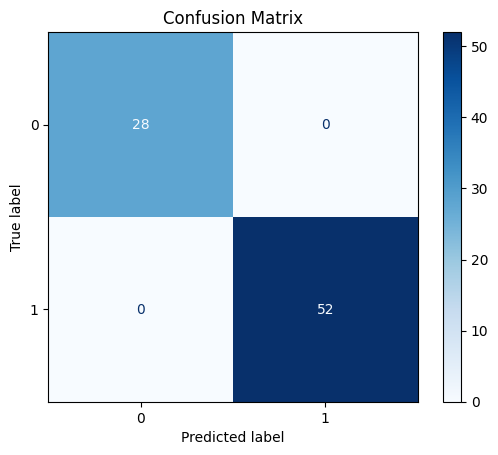
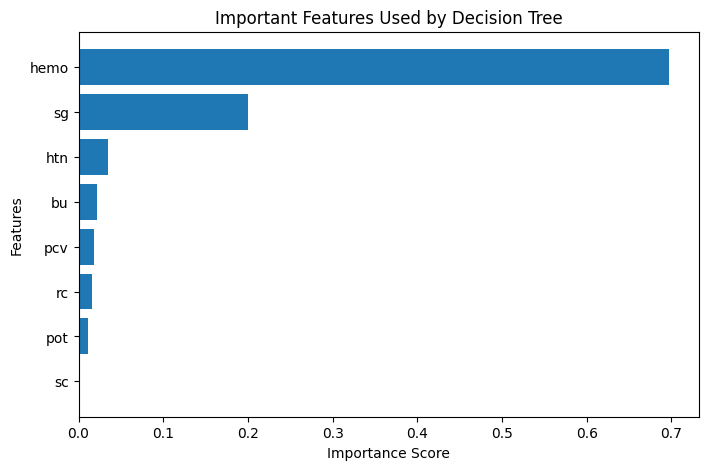
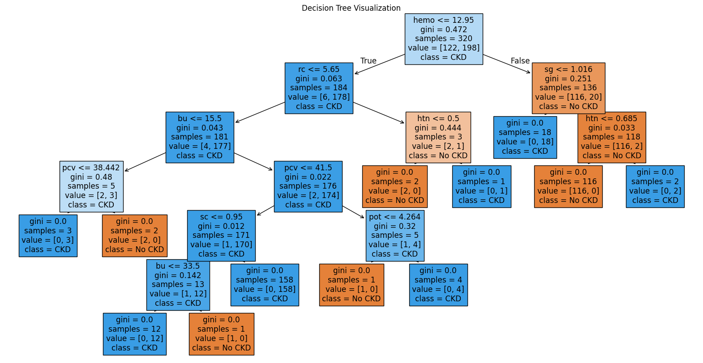

# Explainable Clinical Risk Prediction using Machine Learning and SHAP

### Author: Megha K A

---

## Project Overview

This project presents an interpretable Machine Learning framework for predicting Chronic Kidney Disease (CKD) and diabetes-related clinical risk using a Decision Tree Classifier integrated with Explainable AI (XAI) techniques.

The primary objective of this project is not only to achieve strong predictive performance, but also to improve transparency, interpretability, and trust in healthcare AI systems using SHAP (SHapley Additive Explanations).

The project demonstrates how Explainable AI can support transparent clinical decision-support systems by identifying the most influential clinical features contributing to disease prediction.

---

## Objectives

- Predict Chronic Kidney Disease using Machine Learning
- Apply Explainable AI techniques for transparency
- Improve interpretability in healthcare AI systems
- Analyze feature contributions affecting disease prediction
- Demonstrate trustworthy AI-assisted clinical decision support

---

## Dataset Information

- Dataset: Chronic Kidney Disease Dataset
- Total Samples: 400
- Features: 24 Clinical Attributes
- Target Variable:
  - CKD
  - Not CKD

### Important Clinical Features
- Hemoglobin (hemo)
- Specific Gravity (sg)
- Blood Urea (bu)
- Serum Creatinine (sc)
- Packed Cell Volume (pcv)
- Hypertension (htn)
- Red Blood Cell Count (rc)
- Potassium (pot)

---

## Technologies Used

- Python
- Pandas
- NumPy
- Scikit-learn
- Matplotlib
- SHAP
- Jupyter Notebook

---

# Machine Learning Workflow

## Data Preprocessing
- Removed unnecessary identifier columns
- Converted categorical variables into numerical form
- Handled missing values using mean imputation
- Performed train-test splitting

## Model Development
- Decision Tree Classifier
- SHAP Explainability Framework

## Model Evaluation
The model was evaluated using:
- Accuracy Score
- Precision
- Recall
- F1 Score
- ROC-AUC Score
- Cross Validation
- Confusion Matrix

---

# Model Performance

| Metric | Score |
|---|---|
| Accuracy | 1.00 |
| ROC-AUC Score | 1.00 |
| Average Cross Validation Score | 0.97 |
| Precision | 1.00 |
| Recall | 1.00 |
| F1 Score | 1.00 |

The model demonstrated strong predictive performance while maintaining interpretability through SHAP-based explanations.

---

# Explainable AI (SHAP Analysis)

SHAP explainability methods were applied to understand feature-level contributions influencing CKD prediction outcomes.

## Key Explainability Insights

The most influential clinical features identified were:

- Hemoglobin (hemo)
- Specific Gravity (sg)
- Hypertension (htn)
- Blood Urea (bu)
- Packed Cell Volume (pcv)

SHAP analysis enabled:
- Global interpretation of model behavior
- Local patient-level prediction explanations
- Transparent clinical feature contribution analysis

---

# Visualizations

## SHAP Summary Plot

The SHAP Beeswarm plot demonstrates the global impact of clinical features influencing CKD prediction.

---

## ROC Curve

The ROC-AUC score of 1.00 indicates excellent classification capability between CKD and non-CKD classes.

---

## Confusion Matrix

The confusion matrix demonstrates highly accurate classification performance with minimal prediction error.

---

## Feature Importance Plot

Feature importance analysis identified Hemoglobin and Specific Gravity as major predictors influencing CKD prediction.

---

## Decision Tree Visualization

The Decision Tree visualization improves interpretability by illustrating how clinical variables contribute to prediction decisions.

---

# Research Significance

This project demonstrates the importance of Explainable AI in healthcare applications by combining predictive performance with model transparency.

Unlike traditional black-box systems, SHAP explanations improve interpretability and trustworthiness, making AI-assisted healthcare prediction systems more clinically understandable.

---

# Future Improvements

- Multi-model comparison
- Hyperparameter optimization
- Deep learning explainability frameworks
- External clinical dataset validation
- Calibration analysis for healthcare reliability
- Real-world healthcare deployment

---

# Repository Structure

 ├── Explainabele_diabets_ckd.ipynb
 ├── README.md 
 ├── Explainable AI for CKD Prediction using Machine Learning and SHAP.pdf
 ├── shap_summary_ckd.png 
 ├── roc_curve.png
 ├── confusion_matrix.png
 ├── feature_importance.png 
 └── decision_tree.png 

---

# Author

Megha K A  
Machine Learning | Explainable AI | Healthcare AI | Clinical Decision Support Systems
