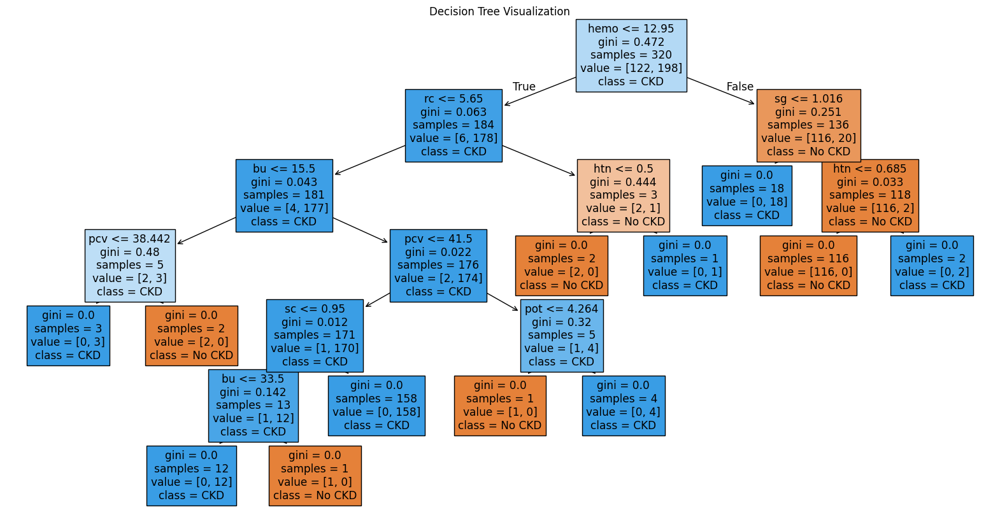
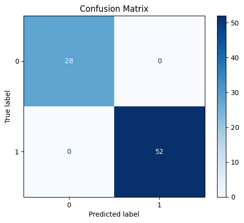
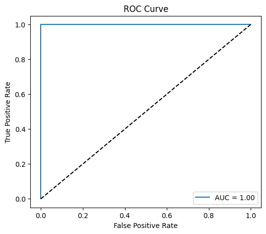
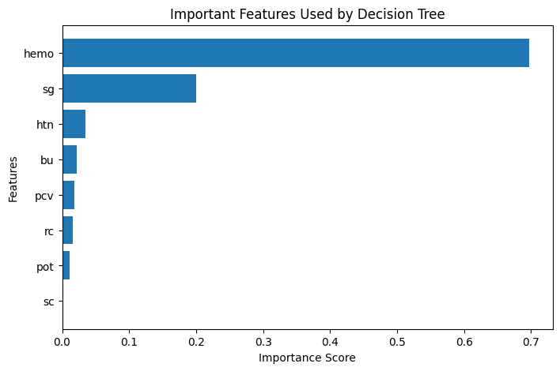

# Explainable Machine Learning Framework for Chronic Kidney Disease Prediction using SHAP


---

## 📌 Overview

This project proposes an **interpretable machine learning framework for Chronic Kidney Disease (CKD) prediction** using a Decision Tree classifier combined with **SHAP-based explainability**.

The goal is to move beyond black-box prediction systems and provide **clinically interpretable AI models** that can support healthcare decision-making.

---

## 🎯 Objectives

- Develop a predictive model for CKD classification  
- Apply SHAP-based explainability for interpretability  
- Identify key clinical risk factors  
- Improve transparency in healthcare AI systems  
- Support clinical decision-making with interpretable ML  

---

## 🧠 Methodology

The workflow includes:

- Data preprocessing and cleaning  
- Handling missing values and encoding categorical variables  
- Training a Decision Tree classifier  
- Evaluating model performance  
- Applying SHAP for global and local explanations  

---

## 📊 Dataset

- Source: UCI Chronic Kidney Disease Dataset  
- Samples: 400  
- Features: 24 clinical attributes  
- Classes: CKD / Not CKD  

---

## 📈 Model Performance

| Metric | Score |
|--------|------|
| Accuracy | 1.00 |
| Precision | 1.00 |
| Recall | 1.00 |
| F1 Score | 1.00 |
| ROC-AUC | 1.00 |
| Cross Validation | 0.97 |

---

## 🔍 Explainable AI (SHAP Analysis)

SHAP is used to interpret model predictions and identify clinically significant features.

### Key Insights:
- Hemoglobin is the most influential predictor  
- Specific Gravity strongly impacts classification  
- Hypertension and Blood Urea are key clinical indicators  
- SHAP enables both global and patient-level interpretability  

---

# 📊 Results & Visualizations

## 🌳 Decision Tree Structure


---

## 📉 Confusion Matrix


---

## 📈 ROC Curve


---

## 🔥 SHAP Summary Plot


---

## 📊 Feature Importance


---

## 🧪 Interpretation of Results

- The model achieves high predictive performance on CKD classification  
- SHAP analysis improves interpretability by explaining feature contributions  
- Clinical variables such as Hemoglobin and Specific Gravity dominate prediction behavior  
- The framework demonstrates the importance of explainability in healthcare AI  

---

## 🧪 Technologies Used

- Python  
- Scikit-learn  
- Pandas / NumPy  
- Matplotlib  
- SHAP  
- Jupyter Notebook  

---

## 📄 Research Output

This repository includes an IEEE-style research manuscript.

A Zenodo DOI will be added upon publication for academic citation and archival.

---

## 🚀 How to Run

```bash
git clone https://github.com/MeghaKA/Explainable-AI-CKD-Prediction-SHAP.git
cd Explainable-AI-CKD-Prediction-SHAP
pip install -r requirements.txt
jupyter notebook notebooks/CKD_SHAP.ipynb

---

## 📌 Future Work

The current work can be extended in several directions to improve both predictive performance and clinical applicability:

- Integration of multiple machine learning models (Random Forest, XGBoost, LightGBM)
- Hyperparameter optimization for improved generalization
- Validation on external and larger clinical datasets
- Calibration analysis for improving clinical reliability
- Development of a deployable clinical decision support system
- Extension to multi-disease prediction frameworks
- Exploration of advanced explainability techniques beyond SHAP (e.g., LIME, Integrated Gradients)

---

## 📜 License

This project is licensed under the MIT License.

You are free to use, modify, and distribute this work with proper attribution.

See the LICENSE file for full details.

---

## 📖 Citation

If you use this work in your research, please cite it as:

Megha K A. (2026). *Explainable Machine Learning Framework for Chronic Kidney Disease Prediction using SHAP-Based Interpretability*. GitHub Repository.

Zenodo DOI (to be added after publication).

---

## 👩‍💻 Author & Research Profiles

**Megha K A**  
M.Sc. Data Analytics  
Machine Learning | Explainable AI | Healthcare AI | Clinical Decision Support Systems  

---

###🔗 Professional Links

- GitHub: https://github.com/MeghaKA  
- LinkedIn: https://linkedin.com/in/meghaka1998  
- Medium: https://medium.com/@meghaka1998  

---

### 📌 Research Focus Areas

- Explainable Artificial Intelligence (XAI)  
- Healthcare Machine Learning  
- Clinical Risk Prediction Systems  
- Interpretable AI for Medical Decision Support

